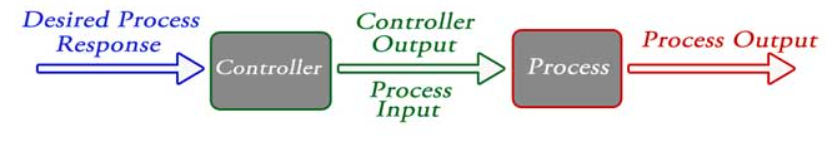

# src - Lê Ngọc Tuấn - Lập trình Robot 2025

# A. Công việc đã làm

## 1. Cơ cấu điều khiển PID, openloop, closeloop 
### 1.1. Cơ cấu điều khiển PID 
- Set Point(SP): là giá trị do người dùng nhập, để điều khiển hệ thống.
- Process Value (PV): là giá trị đang được kiểm soát. Là giá trị hiện tại của hệ thống
- Output: là giá trị được kiểm soát của bộ điều khiển PID
- Error (Err): là giá trị được bộ điều khiển PID sử dụng để xác định thao tác đầu ra để đưa giá
trị quá trình đến điểm đặt. (Error = Setpoint - Process Value <=> Err = SP - PV)
- Bộ điều khiển PID liên tục theo dõi giá trị lỗi và sử dụng giá trị này tính toán
các giá trị tỷ lệ, tích phân và đạo hàm.
- Gain: là thuật ngữ được sử dụng cho "hệ số nhân". Bằng cách điều chỉnh cài đặt hệ số nhân tỷ lệ (kP), tích phân(kI) 
và đạo hàm (kD), sao cho đầu ra của hệ thống có giá trị gần đúng nhất với đầu ra mong muốn

- Tỷ lệ (P): P = kP * (SP - PV)
- Tích phân (I): It = It + kI * Err * dt
	+ It là tổng tích phân
	+ kI là hệ số nhân tích phân để đầu ra ổn định 
	+ dt là thời gian của 1 chu kỳ bao gồm: đọc tín hiệu đầu vào, xử lý logic, và cập nhật đầu ra
- Đạo hàm (D): D = kD * (Err - pErr) / dt
	+ pErr: là giá trị lỗi trước, có nghĩa là sau khi set point thì pErr = Err
- Output = P + It + D
- Công thức PID: 	
	
	
		Err = Sp – PV
		P = kP x Err
		It = It + (Err x kI x dt)
		D = kD x (pErr – Err) / dt
		pErr = Err
		Output = P + It + D
### 1.2. openloop
- Một hệ thống điều khiển trong đố hành động điều khiển hoàn toàn độc lập với đầu ra của hệ thống 	
- Sơ đồ khối: 

- Ưu điểm: 
	+ Ổn định
	+ Thuận tiện để sử dụng
- Nhược điểm: 
	+ Không chính xác
	+ Bất kỳ thay đổi nào trong đầu ra không thể được sửa tự động
### 1.3. closeloop
- Hệ thống sẽ điều chỉnh đầu vào dựa vào sự phản hồi của quả trình đầu ra
- Cách phản hồi của closeloop: tín hiệu được so sánh với đầu vào tham chiều và tín hiệu lỗi được tạo ra.
- Sơ đồ khối: 

- Ưu điểm: 
	+ Chính xác hơn ngay cả khi có tính phi tuyến tính
	+ Độ chính xác cao vì bất kỳ lỗi nào phát sinh đều được sửa chữa do sự hiện diện của tín hiệu phản hồi
	+ Phạm vi băng thông lớn
	+ Tạo điều kiện tự động hóa
	+ Độ nhạy của hệ thống có thể được làm nhỏ để hệ thống ổn định hơn
	+ Ít bị ảnh hưởng bởi tiếng ồn
- Nhược điểm: 
	+ Rất phức tạp để thiết kế
	+ Yêu cầu bảo trì nhiều
	+ Phản hồi dẫn đến phản ứng dao động

### 1.2. Cách đọc các loại cảm biến, cách giảm thiểu nhiễu cho cảm biến 
### 1.2.1. Cách đọc các loại cảm biến
- Đọc giá trị analog, digital bằng Arduino IDE, python,...
### 1.2.2. Cách giảm thiểu nhiễu cho cảm biến
- Sử dụng bộ lọc nhiễu Kalman: 
	+ B1: Khởi tạo trạng thái hệ thống. 
	+ B2: khởi tạo lại trạng thái hệ thống
	+ B3: Dự đoán ước tính trạng thái hệ thống
	+ B4: Tính toán độ lợi Kalman
	+ B5: Ước tính trạng thái hệ thống và ma trận hiệp phương sai lỗi trạng thái hệ thống 
## 2. CÁC THIẾT KẾ XE DÒ LINE KHÁC NHAU & CÁC LOẠI MAP THI ĐẤU DÒ LINE.
### 2.1. Các thiết kế xe dò line khác nhau
- Thiết kế 2 bánh chủ động + 1 bánh tự do (dạng 3 bánh)
	+ Hai bánh chính được gắn với động cơ (thường là DC hoặc Servo).
	+ Một bánh tự do hoặc bi lăn giữ thăng bằng.
	+ Ưu: Đơn giản, dễ chế tạo.
	+ Nhược: Khó đạt tốc độ cao trên map phức tạp.
- Thiết kế 4 bánh (mỗi bên 2 bánh)
	+ Tăng diện tích tiếp xúc → bám đường tốt hơn.
	+ Thường dùng 4 động cơ DC hoặc 2 động cơ + truyền động đai.
	+ Ưu: Ổn định khi vào cua.
	+ Nhược: Cấu trúc nặng hơn.
- Thiết kế chuyên nghiệp dạng F1
	+ Khung dài, mỏng, trọng tâm thấp.
	+ Có thể dùng nhiều cảm biến hồng ngoại bố trí dàn hàng ngang hoặc hình vòng cung.
	+ Ưu: Tốc độ cao, ôm cua mượt.
	+ Nhược: Yêu cầu tuning PID chuẩn.
- Thiết kế cân bằng (Omni wheel)
	+ Dùng bánh Mecanum hoặc Omni cho khả năng di chuyển đa hướng.
	+ Hiếm dùng trong line follower vì tăng độ phức tạp điều khiển.
### 2.2. Các loại bản đồ thi đấu dò line
- Đường thẳng + cua đơn giản
	+ Phù hợp cho xe beginner, tập trung luyện PID cơ bản.
- Map zigzag
	+ Yêu cầu phản ứng nhanh, giảm trễ cảm biến.
- Map có ngã rẽ & lựa chọn đường
	+ Thường dùng trong thi đấu phân nhánh hoặc tìm đường ngắn nhất.
- Map có vòng tròn hoặc khúc cua gấp
	+ Cần PID tốt và cảm biến đặt hợp lý.
- Map hỗn hợp
	+ Vừa dò line vừa tránh vật cản.
## 3. CÁC THÀNH PHẦN CHÍNH TRONG XE DÒ LINE VÀ VAI TRÒ
### 3.1. Khung xe
- Vật liệu: mica, nhôm, 3D printed, composite.
-Ảnh hưởng tới trọng lượng & độ bền.
### 3.2. Động cơ
- DC Motor + Encoder
+ Điều khiển tốc độ qua PWM.
+ Ưu: Giá rẻ, dễ điều khiển.
+ Nhược: Cần encoder để phản hồi tốc độ.
- Servo 360°
+ Điều khiển góc/tốc độ.
+ Ưu: Dễ lắp.
+ Nhược: Momen xoắn thấp.
### 3.3. Cảm biến
- Cảm biến hồng ngoại: 
	+ nguyên lý: một led phát tia hồng ngoại vào mặt phản xạ một photodiode nhận lại tia phản xạ
	+ ưu điểm: dễ dùng, tốc độ đọc nhanh 
	+ Nhược điểm: dễ bị nhiễu
- Cảm biến quang học: 
	+ Nguyên lý: cũng chiếu và thu như hồng ngoại nhưng thay hồng ngoại bằng ánh sáng nhìn thấy
	+ Ưu điểm: Dễ fix
	+ Nhược điểm: Nhạy với ánh sáng môi trường

### 3.4. Driver động cơ
- TB6612FNG: 
	+ Ưu điểm: Nhỏ gọn, hiệu suất cao, ít nóng, dễ điều khiển
	+ Nhược điểm: không chịu được dòng >3A
	+ Ứng dụng: phổ biến trong các xe dò line, micromouse
- L298N: 
	+ Ưu điểm: Rẻ, dễ tìm, có tản nhiệt, đa năng
	+ Nhược điểm: To, nặng, hiệu suất thấp, nóng
- DRV8833: 
	+ Ưu điểm:Siêu nhỏ, hiệu suất cao, chạy ổn với pin 7.4v
	+ Nhược điểm: không phù hợp với dòng > 12v
	
### 3.5. Nguyên lí hoạt động của xe dò line:
- Đầu tiên các cảm biến IR liên tục phát-thu các tia hồng ngoại, tùy vào từng màu sắc sẽ trả về từng giá trị hồng ngoại khác nhau. Dựa vào từng giá tị được trả về,
vi điều khiển sẽ xử lí so sánh với các ngưỡng để phát hiện vị trí của xe đang ở đâu trên đường line, từ đó đưa ra lệnh để điều khiển bánh xe sao cho hợp lí.

## 4. Phân tích thành phần của những xe dò line tìm được trên mạng, sự khác biệt giữa các loại đó.

### 4.1. Arduino Line Follower Kit
1. Bộ khung (Chassis)
- Khung xe (thường làm từ mica, acrylic, nhôm hoặc nhựa cứng)
- Bánh xe (2 bánh chủ động + 1 bánh tự do / bánh xoay)
- Giá đỡ cảm biến, pin, động cơ
2. Bộ điều khiển
- Arduino Uno / Arduino Nano / Arduino Mega (thường là Uno R3)
- Driver điều khiển động cơ (thường là L298N hoặc L293D)
3. Động cơ
- Động cơ DC giảm tốc (thường là 2 động cơ gắn bánh xe)
- Trục nối / khớp nối bánh xe
4. Cảm biến dò line
- Cảm biến hồng ngoại IR (thường là module 3, 5 hoặc 8 mắt)
- Dùng để nhận biết vạch đen/trắng trên đường
5. Nguồn cấp
- Pin Li-ion (2–3 cell) hoặc pin AA
- Hộp pin (2/4 khe)
- Có thể kèm module sạc pin (TP4056)
### 4.2. Pololu 3pi+
1. Khung và kết cấu
- Thân robot tròn, đường kính ~97 mm.
- Vỏ nhựa ABS bền, nhẹ.
- Bánh xe cao su 32 mm (2 bánh chủ động) + bánh chống lật phía sau.
- Ngăn chứa pin AAA (4 viên).
2. Bộ điều khiển
- Vi điều khiển ATmega32U4 (tương thích Arduino Leonardo).
- Hỗ trợ nạp chương trình qua USB.
- Tích hợp bộ ổn áp nguồn và mạch quản lý pin.
3. Động cơ
- 2 động cơ DC Micro Metal Gearmotor của Pololu.
- Tỉ số truyền tuỳ phiên bản (15:1, 30:1, 50:1…).
- Có encoder (tùy bản) để đo tốc độ bánh xe.
4. Cảm biến
- Cảm biến dò line: 5 mắt hồng ngoại IR reflectance sensor ở phía trước.
- IMU: Gia tốc kế + con quay hồi chuyển 3 trục.
- Cảm biến va chạm (bumpers) – tuỳ phiên bản.
5. Nguồn cấp
- 4 pin AAA (NiMH hoặc Alkaline).
- Có mạch sạc nếu dùng pin sạc NiMH.
- Tích hợp bảo vệ điện áp.
6. Hiển thị & điều khiển
- Màn hình LCD 8×2 ký tự.
- 3 nút điều khiển + 1 nút reset.
- Buzzer (còi piezo) để phát âm thanh.

# B. Tài liệu tham khảo
- PID: https://pidexplained.com/pid-controller-explained/
- Bộ lọc Kalman: https://thekalmanfilter.com/kalman-filter-explained-simply/
- Hướng dẫn sử dụng bộ lọc Kalman: http://arduino.vn/tutorial/1492-bo-loc-kalman-giai-phap-chong-nhieu-tuyet-voi-cho-moi-du-su-dung-cam-bien
# C. Khó khăn gặp phải
- Không

