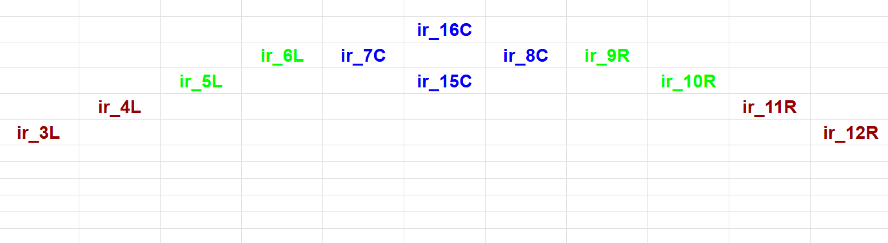
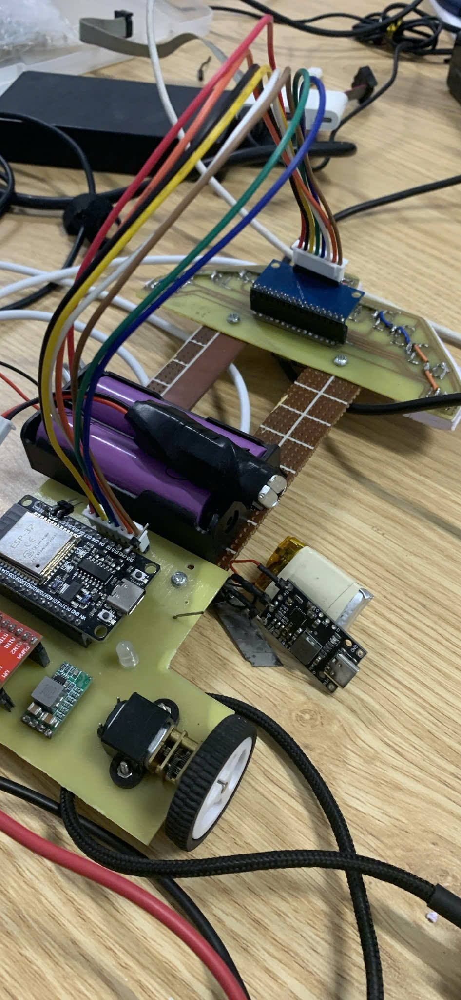
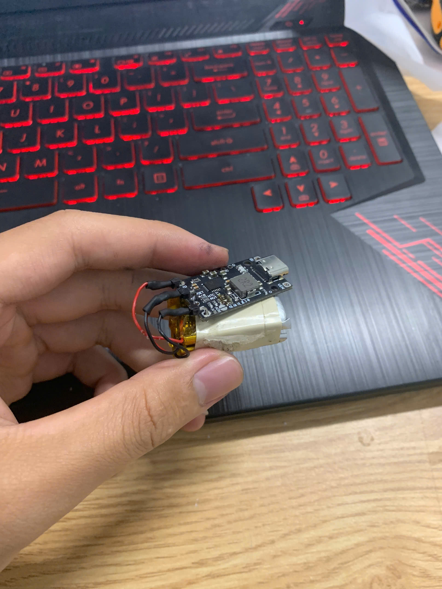

# src - Lê Ngọc Tuấn - Lập trình Robot 2025

# I. Phương án xác định line
- Led 1. Chọn led 7, 8, 15, 16 làm led xác định xe vẫn ở trên line đen
- Led 2. Chọn led 5, 6 làm led xác định độ lêch nhẹ về phía bên phải line -> +speed
- Led 3. Chọn led 9, 10 làm led xác định độ lêch nhẹ về phía bên trái line -> -speed
- Led 4. Chọn led 3, 4 làm led xác định độ lệch mạnh về phía bên phải line -> ++speed
- Led 5. Chọn led 11, 12 làm led xác định độ lêch nhẹ về phía bên trái line -> --speed

## II. Phương án code 

### 1. Nếu 1 trong 4 led "6, 7, 8, 15, 16" hoặc "7, 8, 15, 16, 9" nằm trong vùng line thì cho xe đi thẳng

### 2. Led nhóm  2, 3 chia thành đọc từng led 1 (chưa xác định đc giá trị trả về cho PID)

### 3.  

## III. Công việc đã xong 
- Đo và xác định giá trị các led trên nền trắng và line đen - đã xong
- Xác định giá trị "readValue" từ Ir. -> đưa ra giá trị trả về phù hợp vs độ lệch line 

##IV. Công việc tiếp theo 

- Bách: code nút nhấn với chức năng (GPIO 27 - Analog)
	+ Nhấn 1 lần đọc line trắng
	+ Nhấn lần 2 đọc line đen
	+ Nhấn lần 3 thì xe hoạt động
- Hà: Code led đơn, chức năng (GPIO 26 - Analog)
	+ Đang đọc line trắng nháy - đọc xong line trắng thì led sáng ổn định 2s rồi tắt
	+ Đang đọc line đen thì nháy - đọc xong line đen thì led sáng ổn định 3s rồi tắt
	+ Trong khi xe chạy nếu xe song song với line thì sáng ổn định, ngược lại nháy led 
- Quý: Lắp nút nhấn vào xe 
- Tuấn: Code PID

## V. Công việc đã làm được
- Đọc line ok trên map 
- Chạy được các góc vuông đơn, góc tù đơn giản
- Pin - sạc: ok
- Có 3 loại pin:

## IV. Khó khăn
- Chạy trên map thật chưa ổn
- Thiếu 1 dây căm header đôi cho sạc này: 

## VII. Khắc phục
- Điều chỉnh hệ sộ Kp và Kd (không cần thay đổi Ki)
- Tạo hàm sử lý các trường hợp góc khác, ngoài góc vuông, góc tù đơn giản
- Chạy trên map thật

 