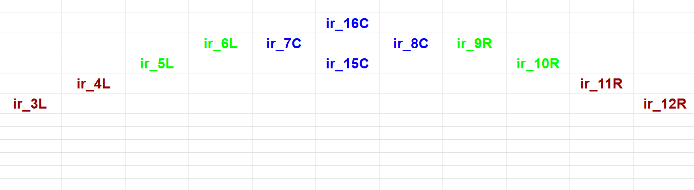

# src - Lê Ngọc Tuấn - Lập trình Robot 2025

# I. Phương án xác định line
Led 1. Chọn led 7, 8, 15, 16 làm led xác định xe vẫn ở trên line đen
Led 2. Chọn led 5, 6 làm led xác định độ lêch nhẹ về phía bên phải line -> +speed
Led 3. Chọn led 9, 10 làm led xác định độ lêch nhẹ về phía bên trái line -> -speed
Led 4. Chọn led 3, 4 làm led xác định độ lệch mạnh về phía bên phải line -> ++speed
Led 5. Chọn led 11, 12 làm led xác định độ lêch nhẹ về phía bên trái line -> --speed

## II. Phương án code 

1. Nếu 1 trong 4 led "6, 7, 8, 15, 16" hoặc "7, 8, 15, 16, 9" nằm trong vùng line thì cho xe đi thẳng

2. Led nhóm  2, 3 chia thành đọc từng led 1 (chưa xác định đc giá trị trả về cho PID)

3.  

## III. Công việc ngày mai
- Đo và xác định giá trị các led trên nền trắng và line đen - đã xong
- Xác định giá trị "readValue" từ Ir. -> đưa ra giá trị trả về phù hợp vs độ lệch line 
 